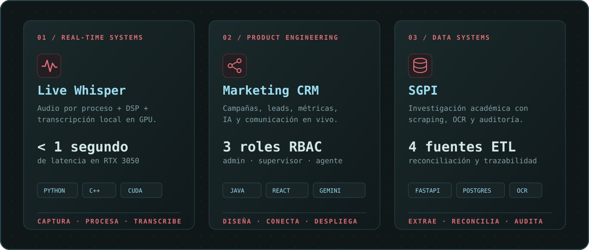

<div align="center">
  
</div>

<div align="center">
  <br />
  <a href="mailto:marecahu02@gmail.com"></a>
  <a href="https://www.linkedin.com/in/marco-castillla/"></a>
  <a href="https://github.com/mrcastilla8?tab=repositories"></a>
</div>

<br />

## [ 01 ] perfil

```text
marco@portfolio:~$ whoami
> Estudiante de Ingeniería de Software en la UNMSM.
> Construyo productos full-stack, automatizaciones con IA y sistemas de datos.
> Estado: abierto a prácticas preprofesionales · Lima, Perú
```

Me gusta convertir problemas complejos en software claro, útil y mantenible. Mi trabajo conecta **producto, backend, datos e inteligencia artificial**: desde plataformas multicanal hasta pipelines ETL y procesamiento de audio en tiempo real.

> **Mi diferencial:** combino criterio técnico con comunicación bilingüe, experiencia real de atención al cliente y curiosidad por entender cada capa del sistema.

| TIEMPO REAL | PRODUCTO END-TO-END | DATOS TRAZABLES |
| :---: | :---: | :---: |
| **< 1 s** de latencia en transcripción local | Frontend + backend + seguridad + despliegue | ETL de **4 fuentes** con reconciliación y auditoría |

## [ 02 ] proyectos_destacados

<div align="center">
  
</div>

### 01 // [Live Whisper Assistant](https://github.com/mrcastilla8/Live-Whisper-Assistant)

Transcripción e interpretación Español ↔ Inglés ejecutada localmente en Windows. Diseñé un pipeline híbrido que captura audio por proceso mediante **C++ y WASAPI**, aplica filtros DSP y ejecuta inferencia acelerada por GPU con faster-whisper. Lo utilizo como soporte en escenarios reales de interpretación.

`Python` `C++17` `WASAPI` `CUDA` `CTranslate2` `PyQt6` `DSP`

### 02 // [Marketing CRM](https://github.com/mrcastilla8/Marketing-CRM)

Plataforma multicanal para campañas, leads y telemarketing. Participé en su construcción full-stack: dashboards, grabaciones, WebSockets, Gemini, seguridad JWT/RBAC, pruebas, Docker y despliegue automatizado.

`Java 17` `Spring Boot` `React` `TypeScript` `MySQL` `Gemini` `WebSockets` · **[Abrir aplicación](https://marketing-crm-pearl.vercel.app)**

### 03 // [SGPI · Investigación FISI-UNMSM](https://github.com/mrcastilla8/JP-SAC)

Sistema para centralizar investigadores, proyectos y publicaciones académicas. Integra scraping, Excel, lectura de PDF y OCR con reglas de prioridad por fuente, auditoría de sincronizaciones y una API construida con FastAPI.

`Python` `FastAPI` `Next.js` `PostgreSQL` `Supabase` `Playwright` `OCR` `ETL`

<details>
  <summary><strong>+ explorar más trabajo</strong></summary>
  <br />

- **[Wankas E-Commerce](https://github.com/mrcastilla8/deploy-wankas):** tienda y panel administrativo con Next.js, Supabase e IA para reconocer alimentos, sugerir recetas y completar ingredientes faltantes.
- **[Proyecto Grupal de IA](https://github.com/mrcastilla8/grupo02-proyecto-ia):** desarrollé el agente de Othello basado en Minimax con poda alfa-beta y participé en la integración del proyecto académico.

</details>

## [ 03 ] tecnologías

<div align="center">
  <p><samp>PRODUCTO · BACKEND · IA APLICADA</samp></p>
  
  <br /><br />
  <p><samp>DATOS · INFRAESTRUCTURA · HERRAMIENTAS</samp></p>
  
</div>

<br />

`Gemini / Genkit` `faster-whisper` `CTranslate2` `Playwright` `OCR` `Oracle PL/SQL` `OpenAPI` `JWT / RBAC`

## [ 04 ] actividad_en_github

<div align="center">
  
  
</div>

<div align="center">
  
</div>

## [ 05 ] más_allá_del_código

También he trabajado como **intérprete bilingüe de servicio al cliente y servicios médicos**. Esa experiencia fortaleció habilidades que aplico directamente a la ingeniería:

- comunicación precisa en español e inglés;
- análisis rápido de contexto y necesidades;
- trabajo bajo estándares de confidencialidad;
- empatía con el usuario y coordinación con equipos operativos.

**Formación:** Ingeniería de Software en la Universidad Nacional Mayor de San Marcos · Inglés C1 certificado por ICPNA.

## [ 06 ] contacto

Estoy abierto a prácticas preprofesionales en **ingeniería de software, backend, full-stack, automatización con IA o productos de datos**.

<div align="center">
  <br />
  <samp>¿Construimos algo útil?</samp>
  <br /><br />
  <a href="mailto:marecahu02@gmail.com"><strong>marecahu02@gmail.com</strong></a>
  <span>&nbsp;·&nbsp;</span>
  <a href="https://www.linkedin.com/in/marco-castillla/"><strong>LinkedIn</strong></a>
  <br /><br />
  <sub>Construyendo sistemas útiles, una decisión de ingeniería a la vez.</sub>
</div>

<!-- Diseño inspirado en interfaces editoriales de sistemas: alto contraste, tipografía monoespaciada y señal sobre ruido. -->
